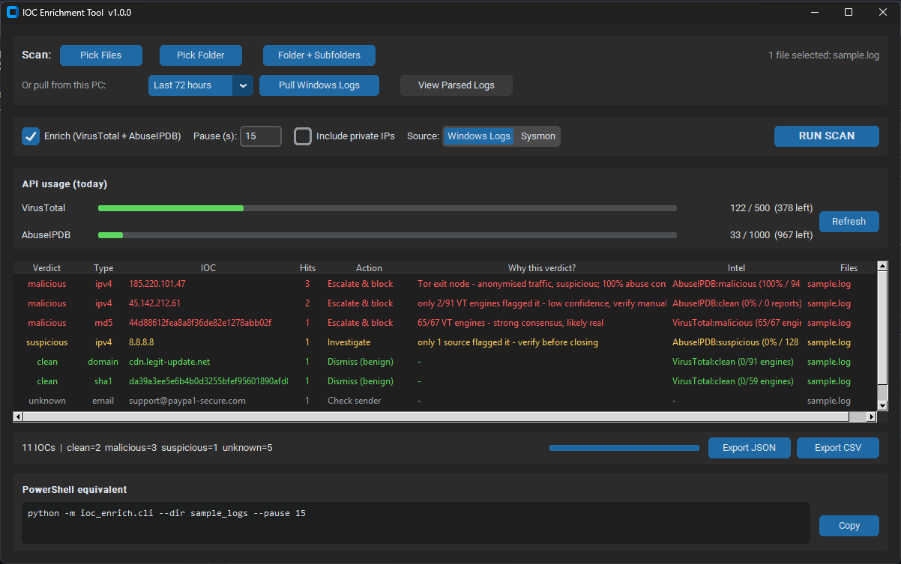

# IOC Enrichment Tool

A desktop + command-line tool for SOC analysts that **parses logs, extracts
indicators of compromise (IOCs), and enriches them with threat intelligence**
from VirusTotal and AbuseIPDB — turning a raw log dump into a prioritised,
analyst-ready triage table in seconds.

Built as part of a SOC analyst / detection-engineering portfolio.



```
┌──────────┐   ┌──────────────┐   ┌────────────────────┐   ┌──────────────┐
│ log file │ → │ IOC extractor │ → │ threat-intel lookup │ → │ triage report │
└──────────┘   └──────────────┘   └────────────────────┘   └──────────────┘
                IP/domain/URL/        VirusTotal +            console table +
                hash/email + defang   AbuseIPDB               JSON / CSV export
```

## Features

- **Extraction** of IPv4, domains, URLs, MD5/SHA1/SHA256 hashes and emails via
  tuned regex, with de-duplication and per-IOC occurrence counts.
- **Defang-aware** — understands `1.2.3.4[.]5`, `evil[.]com`, `hxxps://`,
  `user[at]domain[.]com`, so IOCs pasted from reports/emails are still parsed.
- **Noise reduction** — RFC1918 / loopback / reserved IPs are dropped by default
  (toggle with `--include-private-ips`); domains are validated against the
  official **IANA TLD list** so filenames/identifiers in real logs (e.g.
  `core.msi`, `wer.x.tmp.etl`) aren't mistaken for domains.
- **Multiple logs at once** — pass several files, or point `--dir` at a whole
  folder; IOCs are merged and de-duplicated across all of them, and the report
  shows which file(s) each IOC came from.
- **Enrichment** via two free APIs:
  - **AbuseIPDB** — IP reputation (abuse confidence score + report count).
  - **VirusTotal** — IPs, domains, URLs and hashes (engine detections).
- **Graceful degradation** — runs as a pure extractor when no API keys are set;
  individual provider errors / rate-limits never crash the run.
- **Output** — colour-coded console table (most-malicious first) plus optional
  `--json` and `--csv` export for ticketing or further processing.

## Setup

Requires Python 3.10+.

```powershell
# from the project root
python -m venv .venv
.\.venv\Scripts\Activate.ps1          # PowerShell
pip install -r requirements.txt

# add your API keys (both free; optional)
copy .env.example .env                 # then edit .env
```

Get free API keys:
- VirusTotal: https://www.virustotal.com/gui/my-apikey
- AbuseIPDB: https://www.abuseipdb.com/account/api

## Desktop app (GUI)

A CustomTkinter front-end wraps the same engine — click to scan files, a whole
folder, or a folder + subfolders; results render in a live table and the
equivalent PowerShell command is shown with a copy button.

```powershell
python -m ioc_enrich.gui
```

- Native folder pickers (so "folder + subfolders" is one click).
- Enrichment runs on a background thread with a progress bar — the window never
  freezes during API calls.
- Export results to JSON/CSV from the toolbar.

## Usage (CLI)

```powershell
# extract + enrich the bundled sample
python -m ioc_enrich.cli sample_logs\sample.log

# extract only, no API calls
python -m ioc_enrich.cli sample_logs\sample.log --no-enrich

# several files at once
python -m ioc_enrich.cli sample_logs\sample.log sample_logs\sample2.log

# a whole folder of logs (add --recursive to descend into subfolders)
python -m ioc_enrich.cli --dir sample_logs

# respect VirusTotal's free tier (4 req/min) and export results
python -m ioc_enrich.cli sample_logs\sample.log --pause 15 --json out\iocs.json --csv out\iocs.csv

# check file hashes directly against VirusTotal - no log file needed
python -m ioc_enrich.cli --hash <sha256> <md5> ...
```

### Options

| Flag | Description |
|------|-------------|
| `--dir PATH` | Analyse every file in a folder. |
| `--recursive` | With `--dir`, also descend into subfolders. |
| `--hash HASH...` | Check one or more file hashes (md5/sha1/sha256) straight against VirusTotal, without a log file. |
| `--no-enrich` | Extract only; skip all API calls. |
| `--include-private-ips` | Also report internal/reserved IPs. |
| `--pause SECONDS` | Delay between API calls (free-tier rate limits). |
| `--json PATH` / `--csv PATH` | Export results. |

> **Pairs with the [YARA scanner](https://github.com/Armin-devhub/yara-malware-portfolio):**
> when a YARA rule flags a file, it prints the file's SHA256 — paste it here with
> `--hash` to get a multi-engine VirusTotal verdict. File-layer detection → threat-intel triage.

### Try it on your own machine's logs (Windows)

Windows Event Logs are binary (`.evtx`), so a helper script exports them to
text first:

```powershell
.\scripts\Export-WindowsLogs.ps1 -Hours 24      # writes .\eventlogs\*.log
python -m ioc_enrich.cli --dir eventlogs
```

(Run PowerShell as Administrator to include the Security log. The `eventlogs\`
folder is git-ignored so host data is never committed.)

## Project structure

```
ioc-enrichment-tool/
├── ioc_enrich/
│   ├── extractor.py    # regex extraction, defang + IANA-TLD validation
│   ├── enrichment.py   # VirusTotal & AbuseIPDB clients + quota tracking
│   ├── engine.py       # shared parse→enrich pipeline (CLI + GUI use this)
│   ├── report.py       # verdicts, conclusions, "why" hints, JSON/CSV export
│   ├── logparse.py     # raw-log → readable fields parser
│   ├── cli.py          # argparse entry point
│   ├── gui.py          # CustomTkinter desktop app
│   └── data/tlds.txt   # bundled IANA TLD list
├── scripts/Export-WindowsLogs.ps1   # dump Windows / Sysmon logs to text
├── sample_logs/        # demo logs (sample.log, sample2.log)
├── requirements.txt
└── .env.example
```

## How a verdict is reached

Everything is deterministic and auditable (no AI/black box):

1. **Score → verdict** (per source): AbuseIPDB ≥50% confidence → `malicious`,
   any reports → `suspicious`; VirusTotal ≥1 malicious engine → `malicious`,
   ≥1 suspicious → `suspicious`. The overall verdict is the **worst** across
   providers.
2. **Verdict → recommended action**: `malicious`→Escalate & block,
   `suspicious`→Investigate, `clean`→Dismiss, `unknown`→Manual review / Check
   sender / Enrich first.
3. **"Why this verdict?"**: a plain-English confidence hint built from the raw
   signals (engine count, abuse confidence/reports, Tor flag, domain age,
   version-number-looks-like-an-IP) to guide true- vs false-positive judgement.

## Accuracy & limitations

This is a triage **assistant**, not an autonomous verdict engine. Honest scope:

- **Extraction** is reliable for standard log shapes; very exotic formats may
  leave some parsed fields blank (shown as `-`), and IPv6 is not extracted.
- **Verdicts inherit source noise.** Examples seen on real data:
  - *False positive:* `8.8.8.8` (Google DNS) flagged `suspicious` from
    AbuseIPDB community misreports; `4.0.0.0` (a .NET version string) mis-read
    as an IP. The "Why" column flags both as low-confidence.
  - *True positive:* `185.220.101.47` — a Tor exit node, 100% abuse confidence
    over thousands of reports, multiple VT engines. Correctly escalated.
- **No correlation/context.** It judges each IOC in isolation; it can't see
  "clean IP, but my server talked to it at 3am." That judgement stays with the
  analyst. **Always verify before acting — never auto-block off this output.**

## Notes

- API keys live only in `.env`, which is git-ignored — no secrets are committed.
- Exported machine logs (`eventlogs/`, `sysmonlogs/`) are git-ignored too.
